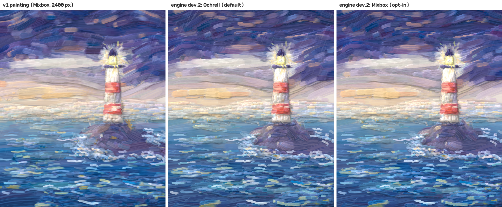
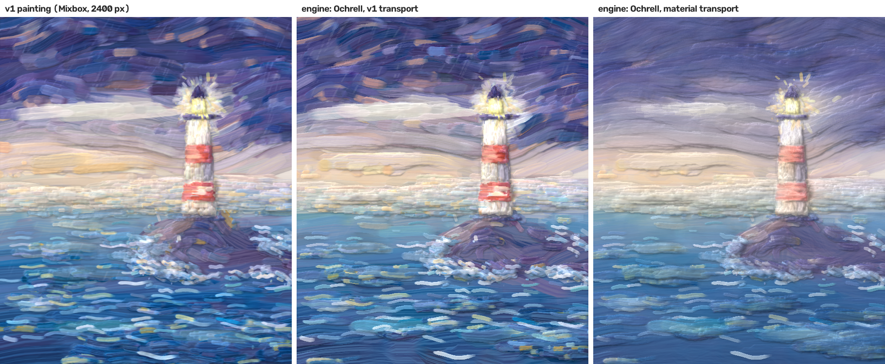

# L1 report: Rust kernel, mixers, maths, codec, CLI

Milestone L1 of `docs/plans/LIBRARY_PLAN.md` (v4), 2026-09-30.

Machine: Windows 11 laptop, Intel Core Ultra 7 258V, 32 GB, rustc 1.91.1 MSVC. Timings are single-thread.
Everything below is *measured* unless marked *projected*.

## Summary

- **The kernel is ported.** The spike kernel was ported first bit for bit, then changed into the engine's kernel:
  counter-based bristle RNG, fixed-order pick-up sums, pure-Rust maths, and a mixer trait.
- **Ochrell is the default mixer.** It is pinned by commit, and never calls the platform `powf`.
- **Mixbox is an opt-in crate.**
- **The rest of L1 is in place:**
  - StrokeList v2 codec with the engine-version gate;
  - image ops, relighting, painter and test sheet;
  - the `oil` CLI;
  - a ctypes shim for the Python eval harness.
- **The port checks pass.** P1 (kernel against the spike = strict C) and P2 (Ochrell against the Ochrell bridge)
  agree within one standard error over 8 seeds. The 17 Ochrell gates pass.
- **Determinism (G1) holds on 7 hosts.** The test sheet and Storm Light give identical SHA-256 on native Windows,
  Node, Chromium, Firefox, WebKit, Edge and Chrome.
- **Size consistency (G3) is 0.03%, against 10.9% for v1.**
- **Storm Light paints faster than projected.** With Ochrell at 600 px it takes 4.6–5.9 s native (the plan
  *projected* 18 s) and 9.1–9.4 s in Chromium and Node (*projected* 22 s).
- **The paint transport is decided:** v1's, with Ochrell (engine `2.0.0-dev.2`). See the update below.

## Update: transport decided, engine `2.0.0-dev.2`

Sean chose v1's transport with Ochrell. Commit `dc6939d` switches the kernel back to the step-2 kernel. It keeps one
change: the bristle streak goes through the mixer, as plain `+ st * dz` for rgb and Mixbox, and limited to K ≥ 0 and
S > 0 for Ochrell.

- **Bit-identical to step 2 with rgb and Mixbox.** A temporary test painted the test sheet at 300 and 700 px with a
  verbatim copy of the step-2 kernel and with the switched kernel, and compared all planes. The P1 port-check
  results above therefore apply unchanged.
- **Ochrell:** 17/17 gates. Canvases need no `amount` plane: 368 B/px with Ochrell (56 with Mixbox).
- **G1:** the test sheet (all planes and the lit image, three mixers) and Storm Light at 600 px are identical on
  native, Node, Chromium, Firefox, WebKit, Edge and Chrome. At 1200 px they are identical on native, Node, Chromium
  and WebKit. The goldens are in `golden/2.0.0-dev.2.json`.
- **G3:** 0.05% of pixels differ by more than 8/255 between 1800 and 2400 px (v1: 10.93%).
- **Timings,** with the process pinned to performance cores (see the note below). Storm Light, 12,433 strokes,
  single thread:

| | 600x750 | 1200x1500 | 2400x3000 |
|---|---:|---:|---:|
| native, Ochrell | 4.1–5.6 s | 13.8–20.5 s | 75.9 s |
| native, Mixbox / rgb | 2.6–3.7 s / 2.4–3.3 s | – | – |
| WASM Chrome / Edge / Chromium | 8.5–9.0 s | 31.1 s (Chromium) | impossible (2 GiB allocation) |
| WASM Node | 9.3 s | 38.1 s | – |
| WASM WebKit | 12.5 s | 49.3 s | – |
| peak memory, native, Ochrell | 169–193 MB | 749 MB | 2.97 GB |

**Timing note.** This laptop's CPU has 4 performance cores (CPUs 0–3) and 4 low-power cores (4–7). The same
single-thread paint takes 2.2 s on a performance core and 3.0 s on a low-power core, and Windows moves threads
between them. Unpinned runs earlier today therefore swung by up to 2×. Numbers above this update were unpinned, so
read them as ranges. From now on, benchmarks pin to the performance cores.

**Next:** the film spike (F0) is scheduled before L7 in the plan. L2 starts now.
## The paint transport (decided: v1's; the original L1 question)

The panels, from left to right:
- **Left:** your v1 painting.
- **Middle:** the new engine with Ochrell on **v1's transport**, meaning the canvas state moves toward the brush
  colour by alpha, and pick-up is v1's "dirt" model.
- **Right:** the engine as committed, with Ochrell on the **material transport** that the Ochrell integration
  introduced. Every pixel carries a paint amount, and a deposit mixes by amount with the wet paint underneath.

Both engine panels paint the same strokes with the same mixer. What they show:
- The material transport mixes each stroke into the wet paint far more: wet-in-wet `mix_t` is about 0.67 against
  v1's about 0.3–0.58. The broken colour, the red bands and the sea dashes wash out.
- The Ochrell integration's own comparison (`../ochrell/results/integration/mixbox/scene/scene-comparison.png`)
  shows the same effect with Mixbox. So the effect comes from the transport, not from Ochrell.
- I adopted the material transport in L1 step 3 because it was the model the integration validated. That was
  a visual decision I should not have made alone.

**Recommendation: v1's transport as the engine's transport, with Ochrell.**
- It keeps the look you built Storm Light with, and the harness thresholds were tuned around it.
- It needs no amount plane (368 instead of 372 B/px).
- It paints at the same speed: 4.6 s at 600 px (material transport: 4.8–5.9 s).
- Paint-amount physics can come back deliberately in L7/L11 (paint that settles, wet stages), where the look is
  judged.

If you agree, the switch is one commit:
- the step-2 transport with Ochrell's validity-preserving streak (already tried; that is the middle panel);
- engine version `2.0.0-dev.2`, with new goldens;
- the port-check tables re-run.

## What changed (commits)

| Commit | What |
|---|---|
| a9c573a | step 1: kernel ported, generic over the mixer; `oil-math` ln/pow/cbrt/atan2/sRGB; `oil-mix` trait + rgb; `oil-mix-mixbox`; `oil-shim` |
| 8c87223 | step 2: counter-based bristle RNG; pick-up sums per fixed 16-row chunk, added in chunk order |
| cc00b93 | `oil-strokes`: StrokeList v2 codec, version gate, validation; spec frozen (`arclen` dropped) |
| 2852b3a | `oil-image`, `oil-light`, `oil-paint` (painter, test sheet), `oil-cli` (`oil`) |
| 8b3ed90 | step 3: material transport as the only transport (**see the decision above**); sRGB transfer tables (pulled forward from L8) |
| d826c51 | Python StrokeList writer, `tools/plan_to_strokelist.py`, `tools/size_consistency.py` |
| c9ce352 | cross-host kernel cases; engine `2.0.0-dev.1`; `golden/2.0.0-dev.1.json` |
| d7c0ac6 | Ochrell as the default mixer, pinned to Ochrell commit `ffd6ee9` |
| 3272fe9 | CLI hashes planes by streaming (peak memory at 2400 px: 6.7 → 3.0 GB) |
| 610e8fe | NOTICE: every third-party crate and licence |
| 219664e | `ci/xhost/scene.mjs`: full-scene timing and determinism in every host |

**In the Ochrell repo** (`../ochrell`), commit `ffd6ee9` adds `encode_linear`:
- It is additive. `encode(c)` is bit-identical to before, tested on 5,093 colours.
- Ochrell's invariants hold: no dependency, no `unsafe`, all 33 tests green, wasm32 check green.
- `MANIFEST.sha256` was regenerated exactly as `tools/package_release.py` does it, but without writing the zip.
- The optimisation agent's rounds 1 and 2 were committed and its tree had been clean for over 30 minutes
  before this.

## Port checks

**P1, step 1: exact port.**
- New kernel against the spike kernel with `detmath` (same exp/sin), same Mixbox latents, through the Python
  shim.
- The sheet at 1600 px and all 12,495 strokes of your Storm Light file at 600 px: **0 differing pixels** on
  lat, rgb, h, wet and cover.
- Against the spike with platform libm: at most 0.08% of pixels differ, by at most 4e-6.

**Spike against C.** The eval harness compares the spike on this machine with `eval/baseline_v1.json` (the C
kernel on Linux):
- The swatch sheet, which exercises only the kernel: **no FAIL or WARN** on any sheet metric.
- The scene: 2 FAIL and 20 WARN, all where planner feedback amplifies small differences.

**P1, step 2: counter RNG.** The single-seed harness compare gave 13 FAIL out of 823 metrics. Over 8 seeds, every
flagged metric matches v1 within about one standard error, so the FAILs were one realisation against another.
The same kernel drawing from PCG32 in v1's draw order agrees too, which rules out a flaw in the hash:

| metric | v1 xorshift32 | PCG32 (v1 order) | counter hash (new) |
|---|---|---|---|
| wet/dry mix contrast, pickup 0.6 | 0.506 ± 0.075 | 0.500 ± 0.057 | 0.500 ± 0.039 |
| wet-in-wet `mix_t`, pickup 0.6 | 0.585 ± 0.075 | 0.581 ± 0.056 | 0.580 ± 0.039 |
| wet-in-wet `mix_t`, pickup 0.3 | 0.310 ± 0.025 | 0.295 ± 0.012 | 0.305 ± 0.026 |
| orange/blue `mix_t` | 0.336 ± 0.032 | 0.296 ± 0.032 | 0.289 ± 0.032 |
| yellow/violet `mix_t` | 0.314 ± 0.030 | 0.352 ± 0.027 | 0.336 ± 0.023 |
| long straight w012 `edge_kink` | 0.089 ± 0.010 | 0.083 ± 0.007 | 0.094 ± 0.018 |
| long curved `bristle_L` | 2.450 ± 0.035 | 2.494 ± 0.050 | 2.401 ± 0.034 |

Mean ± standard error over seeds 1907, 11, 23, 37, 101, 202, 303, 404; eval sheet at 1600 px, default light.

**Material transport**, new kernel against the spike bridge on the `mixbox-material` path, 8 seeds:
- It matches within one standard error, for example wet-in-wet `mix_t` 0.669 ± 0.004 against 0.670 ± 0.002.
- A single seed gives 5 FAIL. Seed 1907's wide stroke places stray-hair lanes on its edge; the other 7 seeds are
  normal.

**P2, Ochrell** against the Ochrell bridge (`native/ochrell-brush`):
- `tools/check_ochrell.py`: **17 of 17 gates pass**.
- Eval sheet over 8 seeds:

| metric | Ochrell bridge (spike kernel) | new kernel, Ochrell |
|---|---|---|
| wet/dry mix contrast, pickup 0.6 | 0.575 ± 0.005 | 0.569 ± 0.004 |
| wet-in-wet `mix_t`, pickup 0.6 | 0.623 ± 0.004 | 0.618 ± 0.002 |
| orange/blue `mix_t` | 0.606 ± 0.003 | 0.609 ± 0.005 |
| yellow/violet `mix_t` | 0.609 ± 0.005 | 0.605 ± 0.004 |
| wet-in-wet L* median | 68.78 ± 0.13 | 68.64 ± 0.25 |
| long curved `bristle_L` | 2.517 ± 0.033 | 2.465 ± 0.029 |

**Lesson for later milestones.** The harness's single-seed thresholds are tighter than the seed-to-seed spread of
the mixing and outline metrics. Engine changes should be judged over several seeds. L5's `oil-metrics` should get a
multi-seed mode.

## Determinism

| Check | Result |
|---|---|
| G1 test sheet | StrokeList bytes, all six planes and the lit image at 400 px, for Ochrell, rgb and Mixbox: **identical** on native Windows, Node 24, Chromium 145, Firefox 146, WebKit 26, Edge 154 and Chrome 154 |
| G1 Storm Light | 13,067 strokes with Ochrell: 600 px **identical on all 7 hosts**; 1200 px identical on native, Node, Chromium and WebKit |
| G3 size consistency | 1800 vs 2400 px downsampled to 600: pixels > 8/255: **0.03%** (v1: **10.93%**, same strokes; target ≤ 1%) |
| G4 version gate | a `2.0.0-dev.0` file is refused by `dev.1` (`ENGINE_VERSION_MISMATCH`, with both versions and a fix); your Storm Light `strokes.npz` gives `V1_STROKE_FILE` pointing to tag `v1-python-c`; codec unit tests cover corruption and value ranges |
| G5 goldens | `golden/2.0.0-dev.1.json`: 25 cases, enforced by `npm run xhost` |
| No platform libm | `clippy.toml` bans it workspace-wide (deny); it caught one `powi` in my own code during L1 |

## Timings and memory (Storm Light, 13,067 strokes, single thread)

| | 600x750 | 1200x1500 | 2400x3000 |
|---|---|---|---|
| native, Ochrell | 4.6–5.9 s | 16.1–18.9 s | 65.5–71.3 s |
| native, Mixbox (material transport) | 3.5 s | – | – |
| native, rgb | 3.0–3.2 s | – | – |
| WASM, Chromium / Chrome / Edge / Node, Ochrell | 9.1–9.4 s | 33–34 s | **impossible** (see below) |
| WASM, WebKit, Ochrell | 15.3 s | 46.9 s | – |
| WASM, Firefox (Playwright build), Ochrell | 78–84 s | – | – |
| *plan v4 projection, native, Ochrell* | *~18 s* | *~59 s* | *~225 s* |
| *plan v4 projection, WASM, Ochrell* | *~22 s* | *~74 s* | – |
| peak memory, native, Ochrell | 171 MB | 712 MB | 3.0 GB |
| wasm memory, Ochrell | 178 MB | 678 MB | – |

- **Ochrell against Mixbox.** In the engine Ochrell costs about 1.6× Mixbox, not the 4× measured through the
  Python bridge. That comes from the display decode through sRGB tables and no Python dispatch.
- **Canvas planes** are 372 B/px with Ochrell, 60 with Mixbox and 44 with rgb (engine's own count).
- **2400 px is impossible in WASM, whatever the memory budget.** On wasm32 a single allocation cannot exceed
  2 GiB, and the Ochrell latent plane is 2.45 GB at 2400x3000. Contiguous storage therefore stops at about
  6.3 Mpx (roughly 2240x2800). Beyond that the browser needs L8's tiled storage. The plan's default desktop cap
  (1600x2000) is below that limit.
- **Firefox timing is unmeasured.** The only Firefox here is Playwright's build, which runs WebAssembly on its
  baseline tier. It is 6–9× slower than Chromium even on plain arithmetic, with or without automation attached.
  Forcing the optimising tier gives "no WebAssembly compiler available". Its output is still bit-identical.
  Measuring a stock Firefox is left for L4.

## What failed or is open

1. **The paint transport** is your decision (above).
2. **Firefox speed** is unmeasured (see above), for L4.
3. **Oversized canvases in WASM.** They abort (`unreachable`) instead of failing cleanly. L4's host must refuse
   with `CANVAS_TOO_LARGE` before allocating, and L8 tiles.
4. **CI has never run on GitHub,** because there is no remote. The Ochrell dependency uses a local `file://` URL
   that CI will need replaced by a remote URL.
5. **Harness mix metrics** are still measured against the Mixbox curve. Making them relative to the active mixer
   is L6.
6. **Speed notes.**
   - Per-pixel `pow` in the linear-light composite cost 3×; tables fixed it in L1.
   - A lazy decode and state traffic are next for L8.

## Images to look at

- `docs/reports/L1/storm_transport_choice.png`: v1 painting / engine with v1 transport / engine with material
  transport. **This one needs your sign-off.**
- `docs/reports/L1/storm_600_ochrell_vs_mixbox.png`: engine Ochrell vs Mixbox on the committed transport.
- `docs/reports/L1/testsheet_800_ochrell_vs_mixbox.png`: the procedural test sheet with both mixers.

## Next

- After the transport decision: switch if you agree (one commit, `2.0.0-dev.2`, new goldens, port tables
  re-run).
- Then **L2**: ScenePlan v1 with JSON Schema, the Rust spec compiler, the TS DSL and validation. Its acceptance is
  Storm Light's guide sheets generated from TS, with the compile time measured.
